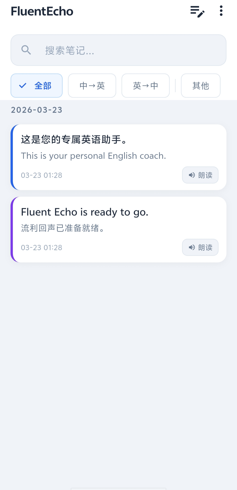
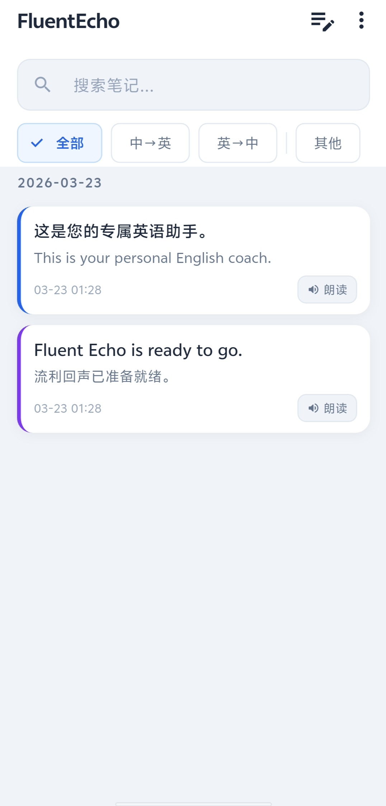

# FluentEcho - AI英语碎片化学习助理

> AI英语碎片化学习助理——支持语音/文字输入、AI 优化润色、TTS 朗读、笔记本管理，专为 Android & iOS 打造。

---

## 截图

| 对话 & AI 优化 | 笔记本列表 |
|:-:|:-:|
|  |  |

---

## 功能亮点

| 功能 | 说明 |
|------|------|
| **多模式输入** | 语音 + 文字；中英双语自动识别 |
| **AI 智能优化** | 中文 → 语法/拼写/词汇优化 → 地道英文；英文 → 优化 + 中文译文 |
| **TTS 朗读** | 多提供商（火山引擎 / SiliconFlow / OpenAI）；可调速、可重放、本地保存 MP3 |
| **智能笔记本** | 自动保存、标签分类、FTS5 全文搜索、关键词高亮 |
| **多 AI 配置** | 支持 DeepSeek / Moonshot Kimi / OpenAI / OpenRouter / MiniMax 等多家 LLM，随时切换 |

---

## 技术栈

| 层级 | 选型 |
|------|------|
| 框架 | Flutter 3.38.10 (Dart 3.10.9) |
| 状态管理 | Riverpod 2.x (code gen) |
| 本地数据库 | Drift 2.x + SQLite FTS5 (trigram) |
| 路由 | go_router 14.x |
| 网络 | Dio 5.x + SSE 流式解析 |
| 音频录制 | record 6.x |
| 音频播放 | just_audio 0.9.x（支持实时变速）|
| 安全存储 | flutter_secure_storage 9.x (Keychain / EncryptedSharedPreferences) |
| 序列化 | freezed + json_serializable |
| CI/CD | GitHub Actions |

---

## 目录结构

```
FluentEcho/
├── lib/
│   ├── main.dart              # 启动入口
│   ├── app.dart               # 路由 & 主题
│   ├── core/                  # 全局基础能力（数据库、网络、存储）
│   ├── features/              # 功能模块
│   │   ├── input/             # 输入 & AI 优化
│   │   ├── notebook/          # 笔记本 & 搜索
│   │   ├── tts/               # TTS 朗读
│   │   └── settings/          # 配置 & AI Key 管理
│   ├── shared/                # 公用组件
│   └── l10n/                  # 国际化
├── android/                   # Android 原生配置
├── ios/                       # iOS 原生配置
├── test/                      # 单元 / Widget / 集成测试
├── docs/                      # 架构文档 & 代码评审记录
└── pubspec.yaml
```

---

## 快速开始

### 环境要求

- Flutter SDK ≥ 3.38.10
- Dart SDK ≥ 3.6.0
- Android Studio / Xcode（对应平台）

### 安装依赖

```bash
flutter pub get
```

### 代码生成（Drift / Riverpod / Freezed）

```bash
dart run build_runner build --delete-conflicting-outputs
```

> **说明**：生成的 `.g.dart` / `.freezed.dart` 文件已提交到仓库，正常情况下无需手动执行。
> 仅在修改了以下内容后才需重新运行：数据库表定义、`@riverpod` Provider、`@freezed` 数据模型。
> `flutter build` / `flutter run` **不会**自动触发代码生成。

### 运行（开发调试）

```bash
# Android（debug 模式，支持热重载）
flutter run -d android

# iOS（debug 模式，支持热重载）
flutter run -d ios
```

> 热重载：运行后在终端按 `r` 键，代码改动即时生效，无需重启 app。

### 构建发布包

```bash
# Android APK
flutter build apk --release

# Android App Bundle (Google Play)
flutter build appbundle --release

# iOS
flutter build ios --release
```

---

## AI 服务配置

在 App 内「设置 → AI服务配置」页面添加你的AI服务，支持以下服务：

| 服务类型 | 支持提供商 |
|----------|-----------|
| LLM（文本优化） | DeepSeek, Kimi（Moonshot）, OpenAI, OpenRouter, MiniMax, 自定义（OpenAI 兼容） |
| STT（语音识别） | 火山引擎 STT（大模型）, SiliconFlow |
| TTS（文字转语音） | 火山引擎 TTS（大模型）, SiliconFlow TTS |

> **安全说明**：所有 API Key 通过 `flutter_secure_storage` 加密存储于设备本地，不上传任何服务器。

---

## 测试

```bash
# 单元测试
flutter test test/unit/

# Widget 测试
flutter test test/widget/

# 集成测试（需连接真实设备）
flutter test integration_test/
```

---

## 贡献

1. Fork 本项目
2. 创建 feature 分支：`git checkout -b feature/your-feature`
3. 提交变更：`git commit -m "feat: 描述"`
4. Push：`git push origin feature/your-feature`
5. 提交 Pull Request

---

## License

MIT License — 详见 [LICENSE](LICENSE)
